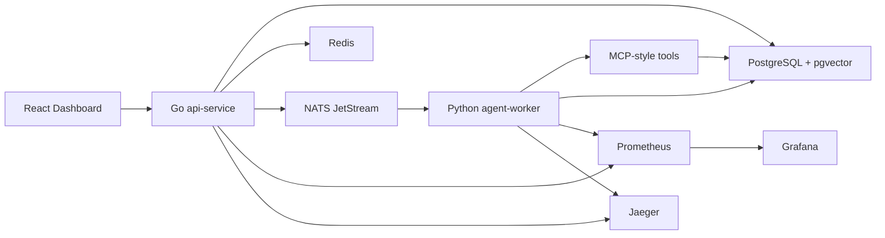

# IncidentPilot：多 Agent AIOps 智能排障平台

IncidentPilot 是一个面向 **后端开发实习** 和 **Agent 应用开发实习** 的多人协作项目。项目模拟 `order`、`payment`、`inventory` 三个微服务出现故障后，由 Agent worker 自动收集日志、指标、服务拓扑和 Runbook 证据，生成可追溯的根因分析报告，并在人工审批后执行安全修复动作。

这个仓库不是单纯 demo，而是按团队项目组织：包含需求文档、架构说明、协作规范、Issue/PR 模板、CI、测试资产和一键启动的 Docker Compose 环境。

> English summary: IncidentPilot is a multi-agent AIOps incident response platform with Go, Python, PostgreSQL/pgvector, Redis, NATS JetStream, React, Prometheus, Grafana, and Docker Compose.

## 项目亮点

- **多 Agent 排障流程**：`triage_agent`、`evidence_agent`、`rca_agent`、`verifier_agent`、`action_agent` 分工协作。
- **后端工程能力**：Go API、PostgreSQL/pgvector、Redis、NATS JetStream、SSE、幂等审批、Docker Compose。
- **Agent 工程能力**：MCP-style tools、Runbook 检索、工具调用审计、证据链、人工审批保护。
- **可观测性**：Prometheus、Grafana、Jaeger、API 指标、Agent 工具调用指标。
- **多人协作友好**：需求、架构、路线图、贡献指南、Issue 模板、PR 模板、GitHub Actions CI。

## 系统架构



核心链路：

1. `POST /api/simulations/faults` 注入模拟故障。
2. `POST /api/incidents` 创建事故，并向 NATS JetStream 发布 `incident.created`。
3. `agent-worker` 消费任务，执行多 Agent RCA 工作流。
4. MCP-style tools 查询日志、指标、拓扑、Runbook，生成修复建议。
5. `GET /api/incidents/{id}/events` 通过 SSE 向前端推送实时进度。
6. `POST /api/incidents/{id}/approve-action` 审批修复动作，worker 才会执行写操作。
7. `GET /api/knowledge/documents` 查询已索引 Runbook，便于团队维护知识库。

## 快速启动

```bash
docker compose up --build
```

启动后访问：

- Web 看板：http://localhost:5173
- API：http://localhost:8080
- Prometheus：http://localhost:9090
- Grafana：http://localhost:3000，默认账号密码 `admin / admin`
- Jaeger：http://localhost:16686

推荐演示路径：

1. 打开 Web 看板。
2. 注入 `order / cache_stampede`，强度设置为 `82`。
3. 创建一条 `order` 事故。
4. 等待 Agent timeline、Evidence chain、Root cause 自动生成。
5. 点击审批按钮执行修复动作。
6. 观察事故状态变为 `resolved`。

## 目录结构

```text
services/api-service      Go REST API、SSE、NATS 发布、幂等、指标
services/agent-worker     Python Agent 工作流和 MCP-style tools
services/web              React + Vite 事故看板
db/init                   PostgreSQL schema、pgvector、种子 Runbook
configs                   Prometheus 和 Grafana 配置
tests/k6                  API 压测脚本
tests/agent_eval          Agent 合成评测集
docs                      需求、架构、演示、评测、路线图、简历材料
.github                   Issue 模板、PR 模板、CI workflow
```

## 对外 API

- `POST /api/incidents`：创建事故诊断任务。
- `GET /api/incidents`：查询最近事故列表，支持 `limit`、`service`、`status`。
- `GET /api/incidents/{id}`：查询事故、证据、Agent 步骤、动作和报告。
- `GET /api/incidents/{id}/events`：订阅 SSE 实时事件。
- `POST /api/incidents/{id}/approve-action`：审批待执行的修复动作。
- `POST /api/knowledge/documents`：上传 Runbook 文档。
- `GET /api/knowledge/documents`：查询已索引 Runbook 文档列表。
- `POST /api/simulations/faults`：注入模拟故障。
- `GET /api/healthz`：健康检查。
- `GET /metrics`：Prometheus 指标。

## 团队协作说明

开始开发前建议先阅读：

- [项目需求](docs/requirements.md)
- [架构说明](docs/architecture.md)
- [贡献指南](CONTRIBUTING.md)
- [开发路线图](docs/roadmap.md)

推荐分工：

- 后端负责人：Go API、幂等、SSE、队列发布、指标。
- Agent 负责人：Python worker、MCP-style tools、Runbook 检索、评测。
- 前端负责人：React 看板、时间线、证据链、审批交互。
- 基建负责人：Docker Compose、PostgreSQL/pgvector、Prometheus、Grafana、CI。

分支命名：

```text
feature/<short-name>
fix/<short-name>
docs/<short-name>
test/<short-name>
```

提交格式：

```text
feat(api): add incident creation endpoint
fix(agent): make action approval idempotent
docs: update architecture guide
test(eval): add cache stampede cases
```

## 测试

本地工具链：

```bash
cd services/api-service && go test ./...
cd services/agent-worker && python -m pytest
cd services/web && npm install && npm run build
```

Docker 方式：

```bash
docker run --rm -v ${PWD}/services/api-service:/src -w /src golang:1.23-alpine go test ./...
docker run --rm -v ${PWD}/services/agent-worker:/app -w /app incidentpilot-agent-worker python -m pytest
docker compose run --rm web npm run build
```

压测：

```bash
k6 run tests/k6/create_incidents.js
```

Agent 评测：

```bash
python tests/agent_eval/run_eval.py
```

## 当前验证情况

当前 MVP 已完成并验证：

- Docker Compose 全栈启动。
- API 健康检查。
- Web 看板访问。
- 最近事故列表和历史事故切换。
- Runbook 文档列表和上传后刷新。
- Prometheus 健康检查。
- 端到端链路：注入故障 -> 创建事故 -> Agent RCA -> 审批动作 -> resolved。
- Go 单元测试。
- Python 单元测试。
- 20 条合成 Agent 评测样例。

## 后续扩展

- 接入 OpenAI-compatible 模型，让 RCA 阶段从确定性规则升级为 LLM 推理。
- 增加真实日志/指标连接器。
- 增加 OpenTelemetry trace。
- 增加权限和角色审批。
- 增加 Kubernetes/Helm 部署。

## 说明

默认 Agent 工作流是确定性的，因此不需要任何付费 LLM Key 就能运行完整演示。后续可以在 `rca_agent` 阶段接入 OpenAI、DeepSeek、腾讯混元或本地 Ollama，只要保持当前 API 和数据库契约不变即可。
