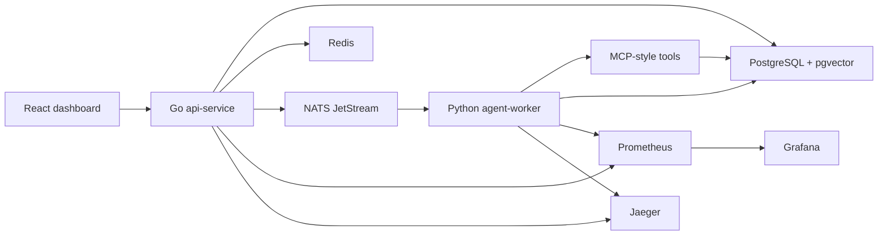

# IncidentPilot

IncidentPilot is a multi-agent AIOps incident response platform built for backend engineering and Agent application practice. It simulates faults across `order`, `payment`, and `inventory` services, then uses a Python agent worker to gather logs, metrics, topology, and runbook evidence before producing a root cause report. Any write-side remediation must be approved by a human before execution.

This repository is organized as a team project. It includes product requirements, architecture notes, collaboration rules, issue templates, tests, and an end-to-end Docker Compose environment.

## Highlights

- Multi-agent RCA workflow: triage, evidence collection, root cause analysis, verification, and action proposal.
- Backend engineering stack: Go API service, PostgreSQL + pgvector, Redis, NATS JetStream, SSE, Docker Compose.
- Agent tooling stack: Python worker, MCP-style tool facade, runbook retrieval, tool audit, guarded execution.
- Observability stack: Prometheus, Grafana, Jaeger placeholder, service metrics, tool-call metrics.
- Team-ready docs: requirements, architecture, API contracts, contribution workflow, issue and PR templates.

## Architecture



Core flow:

1. `POST /api/simulations/faults` injects a synthetic fault.
2. `POST /api/incidents` creates an incident and publishes `incident.created` to NATS JetStream.
3. `agent-worker` runs `triage_agent`, `evidence_agent`, `rca_agent`, `verifier_agent`, and `action_agent`.
4. MCP-style tools gather logs, metrics, topology, runbooks, action proposals, and approved executions.
5. `GET /api/incidents/{id}/events` streams live SSE updates to the dashboard.
6. `POST /api/incidents/{id}/approve-action` approves guarded write actions.

## Quick Start

```bash
docker compose up --build
```

Open:

- Web dashboard: http://localhost:5173
- API: http://localhost:8080
- Prometheus: http://localhost:9090
- Grafana: http://localhost:3000, default login `admin / admin`
- Jaeger: http://localhost:16686

Recommended demo:

1. Open the dashboard.
2. Inject `order / cache_stampede` with intensity `82`.
3. Create an `order` incident.
4. Wait for timeline, evidence, root cause, and approval action.
5. Approve the proposed remediation.
6. Confirm the incident moves to `resolved`.

## Project Layout

```text
services/api-service      Go REST API, SSE, NATS publisher, idempotency, metrics
services/agent-worker     Python agent workflow and MCP-style tools
services/web              React + Vite incident dashboard
db/init                   PostgreSQL schema, pgvector setup, seeded runbooks
configs                   Prometheus and Grafana provisioning
tests/k6                  API load test
tests/agent_eval          Synthetic agent evaluation set
docs                      Requirements, architecture, demo, evaluation, resume notes
.github                   Issue templates and pull request template
```

## Public APIs

- `POST /api/incidents`: create an incident diagnosis task.
- `GET /api/incidents/{id}`: read incident detail, evidence, steps, actions, and report.
- `GET /api/incidents/{id}/events`: stream live SSE events.
- `POST /api/incidents/{id}/approve-action`: approve a pending remediation action.
- `POST /api/knowledge/documents`: upload a runbook document.
- `POST /api/simulations/faults`: inject a synthetic service fault.
- `GET /api/healthz`: service health.
- `GET /metrics`: Prometheus metrics.

## Team Collaboration

Before starting work, read:

- [Product Requirements](docs/requirements.md)
- [Architecture](docs/architecture.md)
- [Collaboration Guide](CONTRIBUTING.md)
- [Development Roadmap](docs/roadmap.md)

Suggested team ownership:

- Backend owner: Go API, idempotency, SSE, queue publishing, metrics.
- Agent owner: Python worker, MCP-style tools, runbook retrieval, evaluation.
- Frontend owner: React dashboard, incident timeline, evidence view, approval UX.
- Infra owner: Docker Compose, PostgreSQL/pgvector, Prometheus, Grafana, CI.

Branch naming:

```text
feature/<short-name>
fix/<short-name>
docs/<short-name>
test/<short-name>
```

Commit style:

```text
feat(api): add incident creation endpoint
fix(agent): make action approval idempotent
docs: add architecture overview
test(eval): add cache stampede cases
```

## Tests

Local toolchains:

```bash
cd services/api-service && go test ./...
cd services/agent-worker && python -m pytest
cd services/web && npm install && npm run build
```

Docker-based checks:

```bash
docker run --rm -v ${PWD}/services/api-service:/src -w /src golang:1.23-alpine go test ./...
docker run --rm -v ${PWD}/services/agent-worker:/app -w /app incidentpilot-agent-worker python -m pytest
docker compose run --rm web npm run build
```

Load test after the stack is running:

```bash
k6 run tests/k6/create_incidents.js
```

Agent evaluation:

```bash
python tests/agent_eval/run_eval.py
```

## Current Validation

The current MVP has been validated with:

- Docker Compose full-stack startup.
- API health check.
- Web dashboard HTTP response.
- Prometheus health check.
- End-to-end incident flow: inject fault -> create incident -> agent RCA -> approve action -> resolved.
- Go unit tests.
- Python unit tests.
- Agent evaluation set with 20 synthetic cases.

## Notes

The current agent workflow is deterministic so the project can run without a paid LLM key. The workflow is structured so an OpenAI-compatible model call can be added later inside the RCA stage without changing the public API or database contracts.

