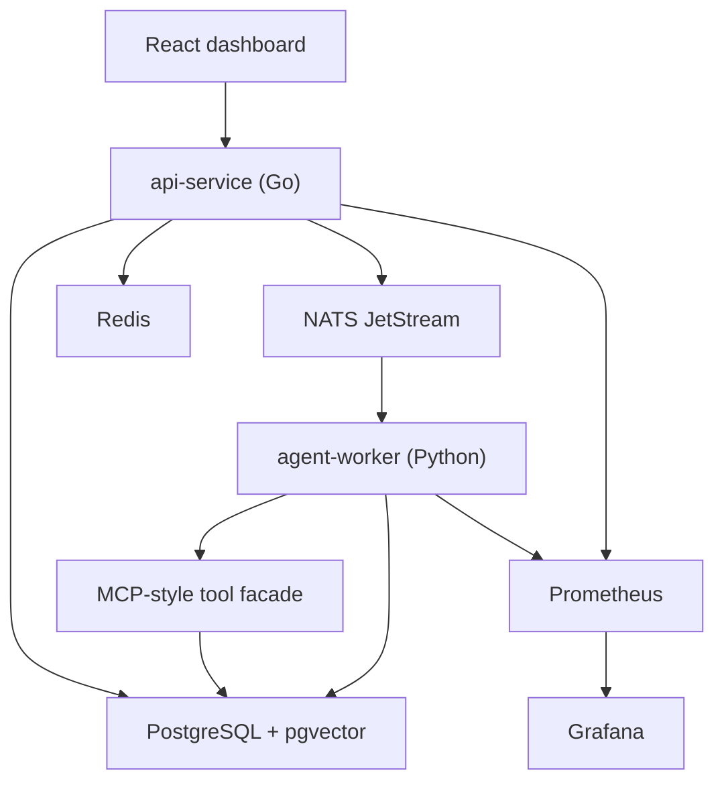
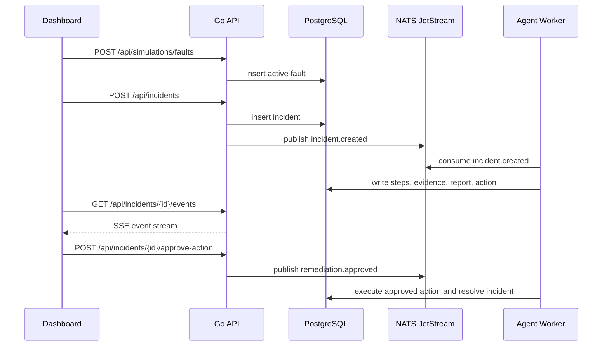

# Architecture

## System Overview

IncidentPilot is a local distributed system composed of API, worker, dashboard, storage, queueing, cache, and observability services.

## Services

### api-service

Responsibilities:

- Validate and persist incidents.
- Publish incident and approval messages.
- Expose REST APIs and SSE streams.
- Enforce idempotency for incident creation and action approval.
- Expose Prometheus metrics.

Technology:

- Go standard HTTP server.
- pgx for PostgreSQL access.
- go-redis for Redis.
- nats.go for JetStream.
- Prometheus Go client.

### agent-worker

Responsibilities:

- Consume `incident.created` messages.
- Execute the multi-agent RCA workflow.
- Call MCP-style tools for logs, metrics, topology, runbook search, action proposal, and approved execution.
- Persist evidence, steps, reports, and action status.
- Consume `remediation.approved` messages.

Technology:

- Python async worker.
- asyncpg for PostgreSQL.
- nats-py for JetStream.
- prometheus-client for tool metrics.
- Deterministic workflow by default, model-ready by design.

### web

Responsibilities:

- Provide the operator dashboard.
- Inject synthetic faults.
- Create incidents.
- Render Agent timeline, evidence, reports, and action approvals.
- Listen to SSE events for live updates.

Technology:

- React.
- Vite.
- CSS modules through plain CSS.

## Data Model

Main tables:

- `incidents`: incident metadata and lifecycle status.
- `incident_events`: SSE event source.
- `evidence`: evidence records from tools.
- `agent_steps`: trace of each agent step.
- `remediation_actions`: approval-gated remediation actions.
- `root_cause_reports`: final RCA report and evidence references.
- `knowledge_documents`: uploaded runbook documents.
- `knowledge_chunks`: searchable runbook chunks with pgvector embeddings.
- `faults`: synthetic active/inactive faults.
- `tool_audit`: tool call audit records.

## Message Flow

## Safety Rules

- Tool inputs are validated.
- Tool calls have timeouts.
- Tool calls write audit records.
- Write actions require approval.
- Approval is idempotent.
- Execution modifies only synthetic `faults`, never host resources.

## Extension Points

- Replace deterministic RCA with an OpenAI-compatible model call.
- Add real log and metric connectors.
- Add OpenTelemetry spans in API and worker.
- Add auth and role-based approval.
- Add Kubernetes manifests after the Docker Compose MVP stabilizes.

