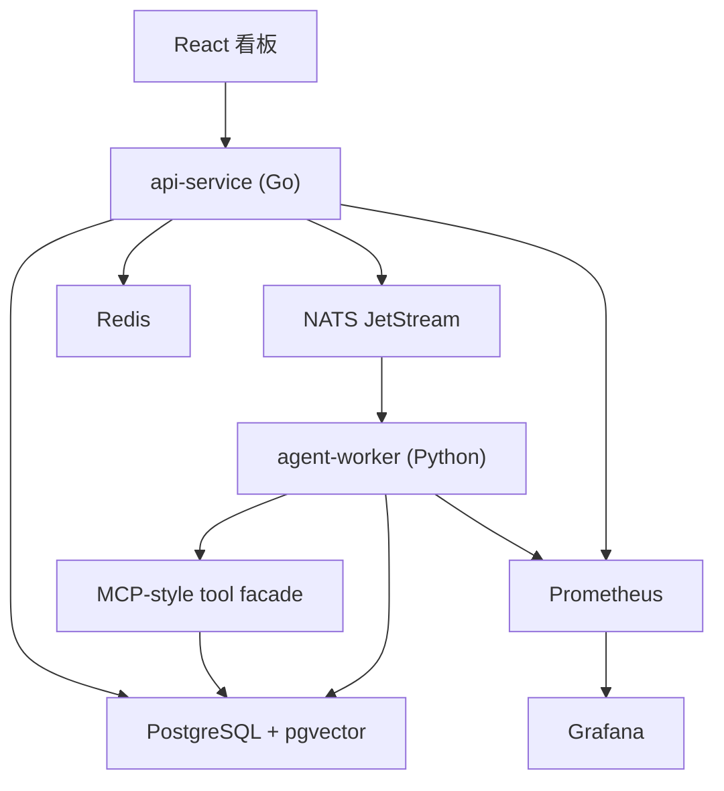
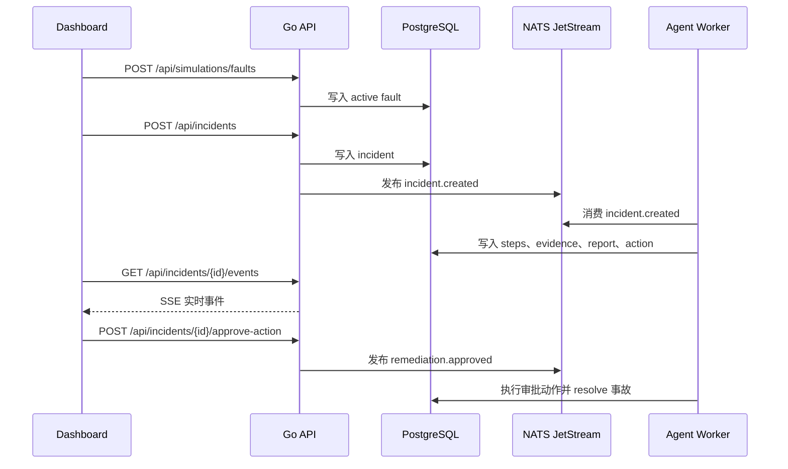

# 架构说明

## 总览

IncidentPilot 是一个本地可运行的分布式系统，由 API、Agent worker、前端、数据库、队列、缓存和可观测性组件组成。

## 服务职责

### api-service

职责：

- 校验并持久化事故。
- 查询最近事故列表。
- 发布事故和审批消息。
- 暴露 REST API 和 SSE 事件流。
- 实现事故创建和动作审批的幂等。
- 暴露 Prometheus 指标。

技术：

- Go standard HTTP server。
- pgx 访问 PostgreSQL。
- go-redis 访问 Redis。
- nats.go 访问 JetStream。
- Prometheus Go client。

### agent-worker

职责：

- 消费 `incident.created` 消息。
- 执行多 Agent RCA 工作流。
- 调用 MCP-style tools 查询日志、指标、拓扑、Runbook、动作建议和审批执行。
- 写入证据、步骤、报告和动作状态。
- 消费 `remediation.approved` 消息并执行已审批动作。

技术：

- Python async worker。
- asyncpg 访问 PostgreSQL。
- nats-py 访问 JetStream。
- prometheus-client 暴露工具调用指标。
- 默认确定性工作流，后续可接入 LLM。

### web

职责：

- 提供事故处理看板。
- 注入模拟故障。
- 创建事故。
- 展示最近事故并切换历史事故。
- 展示 Agent 时间线、证据链、根因报告和审批动作。
- 监听 SSE 事件并实时刷新状态。

技术：

- React。
- Vite。
- Plain CSS。

## 数据模型

核心表：

- `incidents`：事故基本信息和生命周期状态。
- `incident_events`：SSE 事件源。
- `evidence`：工具收集到的证据。
- `agent_steps`：Agent 每一步执行记录。
- `remediation_actions`：需要审批的修复动作。
- `root_cause_reports`：最终 RCA 报告和证据引用。
- `knowledge_documents`：上传的 Runbook 文档。
- `knowledge_chunks`：可搜索的 Runbook chunk 和向量。
- `faults`：模拟故障状态。
- `tool_audit`：工具调用审计记录。

## 消息流

## 安全规则

- 工具输入必须校验。
- 工具调用必须有超时。
- 工具调用必须写审计记录。
- 所有写操作必须人工审批。
- 审批和执行必须幂等。
- 执行器只修改模拟故障数据，不操作真实系统。

## 扩展点

- 将确定性 RCA 替换为 OpenAI-compatible 模型调用。
- 接入真实日志和指标系统。
- 增加 OpenTelemetry trace。
- 增加鉴权和基于角色的审批。
- 增加 Kubernetes manifests 和 Helm chart。
